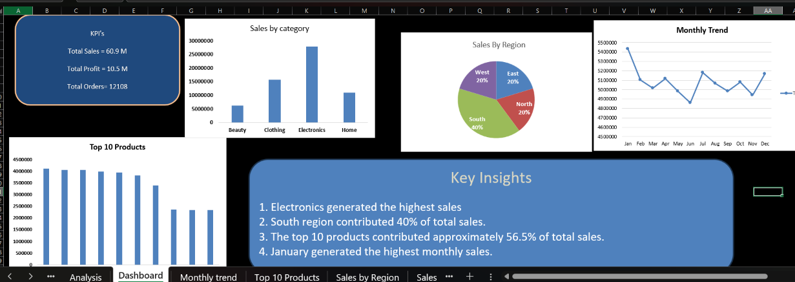

# Retail Sales Analysis Dashboard – Excel

## Project Overview

This project analyzes retail sales data using Microsoft Excel to identify sales trends, top-performing products, regional performance, and category-wise performance.

## Tools & Skills

- Microsoft Excel
- Data Cleaning
- PivotTables
- PivotCharts
- Data Analysis
- Dashboard Creation

## Project Workflow

1. Cleaned and prepared the raw sales data.
2. Handled missing values and inconsistent categorical data.
3. Created PivotTables for sales analysis.
4. Analyzed sales by category and region.
5. Identified the top 10 products by total sales.
6. Analyzed monthly sales trends.
7. Built an Excel dashboard.
8. Summarized key business insights.

## Key Insights

- Electronics generated the highest sales among all categories.
- South region contributed approximately 40% of total sales.
- The top 10 products contributed approximately 56.5% of total sales.
- January generated the highest monthly sales.

## Dashboard

The dashboard includes:

- Total Sales
- Total Profit
- Total Orders
- Sales by Category
- Sales by Region
- Monthly Sales Trend
- Top 10 Products
- Key Business Insights

## Dashboard Preview

